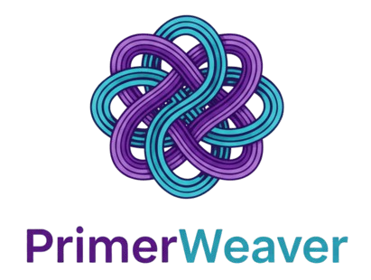

# PrimerWeaver

PrimerWeaver is a client-side web app for primer design across common molecular biology workflows (Golden Gate, Gibson, Restriction cloning, USER cloning, Overlap PCR, Mutagenesis, Multiplex PCR, and Primer QC).



## Quick start (local)

This project uses `fetch()` to load module HTML/JS, so it should be served over HTTP (not opened via `file://`).

```bash
# From the repo root
python -m http.server 8000
```

Then open `http://localhost:8000/`.

Notes:
- The service worker in `app/sw.js` only works on `https://` or `http://localhost/` (browser requirement).
- All computation runs in the browser; there is no backend.

## Contact form (About → Contact Us)

The About page uses a `mailto:` link so it opens your email client with a prefilled message. On GitHub Pages (static hosting), this is the simplest option because there is no backend to send emails directly.

## App modules

The app is hash-routed from `app/app-index.html` via `app/app-main.js`:

- `#/golden-gate` -> `app/modules/Golden_Gate_v1.0.1.html`
- `#/gibson` -> `app/modules/Gibson_V1.0.1.html`
- `#/restriction` -> `app/modules/RE_cloning_v1.0.1.html`
- `#/user` -> `app/modules/USER_V1.0.1.html`
- `#/overlap-pcr` -> `app/modules/oe_pcr_v1.0.1.html`
- `#/mutagenesis` -> `app/modules/mutagenesis_v1.0.1.html`
- `#/multiplex-pcr` -> `app/modules/multiplex_pcr_v1.0.1.html`
- `#/qc` -> `app/modules/QC_V1.0.1.html`

## Project structure

```text
index.html                  # Main website shell: Home / Documents / FAQs / About
contents/                   # Site pages, docs, and assets
  style.css
  script.js
  documents/
  logo/
app/                        # Web app shell (loads modules)
  app-index.html
  app-main.js               # Hash router + module loading
  app-module-loader.js      # Deferred module initialization
  app-style.css             # App UI styles
  sw.js                     # Service worker (optional)
  modules/
    *.html                  # Module UIs
    scripts/
      core_v1.0.1.js         # Shared core utilities (Tm, parsing, etc.)
      bio_visuals_v1.0.1.js  # Shared visuals + MW warning system
      *_v1.0.1.js            # Module logic
    contents/                # Demo assets and figures used by modules
```

## MW (Message Warning) system

Modules use a shared "MW" modal for warnings/confirmations:
- Implementation: `app/modules/scripts/bio_visuals_v1.0.1.js`
- Exports include `showMWModal`, `showMWWarnings`, and shared input/parameter validators.

## Styling notes

- Site (Home/Docs/FAQs/About): `contents/style.css`
- App (module UI): `app/app-style.css`
- Many modules historically shared IDs; module-level CSS should be scoped under the module wrapper IDs (e.g., `#gibson-pane`, `#golden-gate-pane`, `#user-cloning-pane`, `#re-cloning-pane`) to avoid cross-module regressions.
